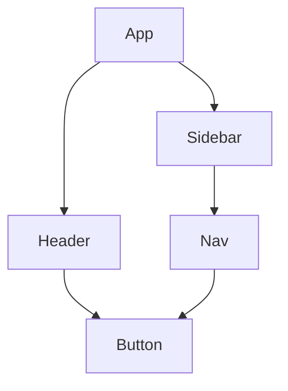

# 36. MCP Server: Filesystem

**Kategorie**: Core MCP Server
**Schwierigkeit**: Fortgeschritten
**Installation**: `npx @modelcontextprotocol/create-server filesystem`
**Offizielle Docs**: [MCP Filesystem Server](https://github.com/modelcontextprotocol/servers/tree/main/src/filesystem)

---

> 🚀 **Claude Code Relevanz**: Der Filesystem MCP Server ist das Fundament jeder Claude Code Session -- er ermoeglicht strukturierten, sicheren Zugriff auf dein Dateisystem und ist damit die Basis fuer alle dateibasierten Workflows.

## 🎯 Was ist MCP?

Dieser Abschnitt erklaert das grundlegende Konzept des Model Context Protocol und warum es fuer die Arbeit mit Claude Code entscheidend ist.

**MCP (Model Context Protocol)** ist ein offenes Protokoll, das es Claude Code ermöglicht, mit externen Services und Tools zu interagieren. Statt nur Code zu generieren, kann Claude durch MCP Server:

- **File System** manipulieren (lesen, schreiben, suchen)
- **Datenbanken** abfragen (PostgreSQL, SQLite)
- **APIs** nutzen (GitHub, Slack, Web Search)
- **Browser** automatisieren (Puppeteer)

Der **Filesystem MCP Server** ist dabei das Fundament - er gibt Claude direkten Zugriff auf dein File System mit strukturierten, sicheren Operationen.

---

## 🔧 Berechtigung

In diesem Abschnitt erfaehrst du, warum der Filesystem MCP Server fuer produktive Claude Code Sessions unverzichtbar ist und welche Vorteile er gegenueber direkten Shell-Commands bietet.

### Warum brauchst du den Filesystem MCP Server?

1. **Strukturierter Zugriff**: Statt bash-Commands nutzt Claude definierte Operationen
2. **Permissions Management**: Definiere genau, welche Verzeichnisse Claude zugreifen darf
3. **Audit Trail**: Alle File-Operationen werden protokolliert
4. **Error Handling**: Bessere Fehlerbehandlung als mit Shell-Commands
5. **Cross-Platform**: Funktioniert identisch auf macOS, Linux und Windows

### Beispiel-Szenario

Dieses Beispiel zeigt den Unterschied zwischen klassischen Shell-Commands und strukturierten MCP-Aufrufen. Ohne MCP muss Claude Text-Output parsen, mit MCP erhaelt es direkt maschinenlesbare JSON-Daten.

**Ohne MCP**:
```bash
# Claude muss Shell-Commands generieren
claude: "Kann ich mal schauen, was in deinem src/ Ordner ist?"
→ Generiert: ls -la src/
→ Problem: Keine strukturierte Rückgabe, schwer zu parsen
```

**Mit MCP Filesystem**:
```json
{
  "method": "read_directory",
  "params": {
    "path": "src/",
    "recursive": false
  }
}
→ Strukturierte JSON-Antwort mit allen Files und Metadaten
→ Claude kann direkt damit arbeiten
```

---

## 🎯 Zwecke

Hier siehst du die fuenf Hauptbereiche, in denen der Filesystem MCP Server eingesetzt wird. Jeder Bereich deckt einen typischen Entwickler-Workflow ab.

Der Filesystem MCP Server wird verwendet für:

### 1. **Directory Exploration**
- Verzeichnisstrukturen analysieren
- Files nach Pattern suchen
- Project Layout verstehen

### 2. **File Operations**
- Files lesen (mit Encoding-Support)
- Files schreiben/updaten
- Files kopieren/verschieben

### 3. **Search Operations**
- Text in Files suchen (grep-like)
- Files nach Name/Extension finden
- Recursive Directory Search

### 4. **Metadata Operations**
- File Stats abrufen (Größe, Modify-Time)
- Permissions checken
- Symlinks verfolgen

### 5. **Safe Operations**
- Backup vor Änderungen
- Atomic Writes
- Permission-basierte Zugriffskontrolle

---

## 💻 Verwendung

In diesem Abschnitt lernst du die Installation, Konfiguration und praktische Nutzung des Filesystem MCP Servers -- von der ersten Einrichtung bis zur Integration in Claude Code.

### Installation

Die folgenden Befehle installieren den MCP Server global oder starten ihn direkt ueber npx, was keine dauerhafte Installation erfordert:
```bash
# NPM Package installieren
npm install -g @modelcontextprotocol/server-filesystem

# Oder direkt via npx (empfohlen)
npx @modelcontextprotocol/create-server filesystem

# MCP Config erstellen
mkdir -p ~/.config/mcp
```

### Konfiguration

Die zentrale Konfigurationsdatei legt fest, auf welche Verzeichnisse Claude zugreifen darf und welche Berechtigungen gelten. Passe die Pfade an deine Projektstruktur an.

**~/.config/mcp/filesystem.json**:
```json
{
  "mcpServers": {
    "filesystem": {
      "command": "npx",
      "args": [
        "-y",
        "@modelcontextprotocol/server-filesystem",
        "/Users/username/projects",
        "/Users/username/documents"
      ],
      "permissions": {
        "read": ["**/*"],
        "write": ["**/*.md", "**/*.txt"],
        "execute": []
      },
      "options": {
        "maxFileSize": "10MB",
        "followSymlinks": false,
        "gitignore": true
      }
    }
  }
}
```

**Wichtige Config-Parameter**:
- **Pfade als Args**: Nur diese Directories sind zugreifbar
- **permissions**: Granulare Read/Write/Execute Controls
- **maxFileSize**: Schutz vor zu großen Files
- **gitignore**: Respektiert .gitignore Patterns

> ⚠️ **Warnung**: Gib niemals das Root-Verzeichnis (`/`) als erlaubten Pfad an. Beschraenke den Zugriff immer auf spezifische Projekt-Verzeichnisse, um versehentliche Aenderungen an Systemdateien zu vermeiden.

### Claude Code Integration

**1. MCP Server starten**:
```bash
# Automatisch beim Claude Code Start
# Oder manuell:
mcp start filesystem
```

**2. Im Claude Code Chat**:
```
Du: "Zeig mir die Struktur von src/"
Claude: [nutzt filesystem.read_directory MCP Tool]
→ Liefert strukturierte Directory-Liste

Du: "Such nach allen TypeScript Files mit 'useEffect'"
Claude: [nutzt filesystem.search MCP Tool]
→ Findet Files und zeigt relevante Code-Snippets
```

### Available MCP Tools

Der Filesystem Server stellt folgende Tools bereit:

#### 1. `read_file`

Liest den Inhalt einer Datei und gibt ihn im angegebenen Encoding zurueck. Ideal, wenn Claude den Quellcode einer bestimmten Datei analysieren soll.
```json
{
  "name": "read_file",
  "description": "Read file contents",
  "parameters": {
    "path": "src/App.tsx",
    "encoding": "utf-8"
  }
}
```

#### 2. `write_file`

Schreibt Inhalt in eine Datei. Mit `createDirs: true` werden fehlende Verzeichnisse automatisch angelegt.
```json
{
  "name": "write_file",
  "description": "Write to file",
  "parameters": {
    "path": "docs/README.md",
    "content": "# My Project\n...",
    "createDirs": true
  }
}
```

#### 3. `read_directory`

Listet den Inhalt eines Verzeichnisses auf. Mit `recursive: true` werden auch Unterverzeichnisse durchsucht.
```json
{
  "name": "read_directory",
  "description": "List directory contents",
  "parameters": {
    "path": "src/",
    "recursive": false,
    "includeHidden": false
  }
}
```

#### 4. `search_files`

Sucht nach Dateien anhand ihres Namens oder einer Glob-Pattern. Nuetzlich, um bestimmte Dateitypen in einem Projektbaum zu finden.
```json
{
  "name": "search_files",
  "description": "Search for files by name",
  "parameters": {
    "path": "src/",
    "pattern": "*.tsx",
    "recursive": true
  }
}
```

#### 5. `search_content`

Durchsucht den Inhalt von Dateien nach einem Suchbegriff -- aehnlich wie grep, aber mit strukturiertem JSON-Output.
```json
{
  "name": "search_content",
  "description": "Search for text in files",
  "parameters": {
    "path": "src/",
    "query": "useEffect",
    "filePattern": "*.tsx",
    "caseSensitive": false
  }
}
```

#### 6. `get_file_info`

Ruft Metadaten einer Datei ab, wie Groesse, Aenderungsdatum und Berechtigungen.
```json
{
  "name": "get_file_info",
  "description": "Get file metadata",
  "parameters": {
    "path": "package.json"
  }
}
```

#### 7. `create_directory`

Erstellt ein neues Verzeichnis. Mit `recursive: true` werden auch fehlende Eltern-Verzeichnisse angelegt.
```json
{
  "name": "create_directory",
  "description": "Create new directory",
  "parameters": {
    "path": "src/components/new-feature",
    "recursive": true
  }
}
```

---

## 🏆 Best Practices

Die folgenden Best Practices helfen dir, den Filesystem MCP Server sicher und effizient einzusetzen. Besonders wichtig sind die Berechtigungseinstellungen, da sie bestimmen, was Claude mit deinen Dateien tun darf.

### 1. **Permission-Basierte Sicherheit**

Definiere granulare Berechtigungen, damit Claude nur die Dateitypen lesen und schreiben kann, die es wirklich braucht. Das Ausrufezeichen (`!`) vor einem Pattern schliesst bestimmte Dateien explizit aus.
```json
{
  "permissions": {
    "read": ["**/*"],              // Alles lesen OK
    "write": [
      "src/**/*.tsx",              // Nur React Files schreiben
      "docs/**/*.md",              // Nur Docs schreiben
      "!src/config/*.json"         // Config-Files schützen
    ],
    "execute": []                  // Keine Execute-Rechte
  }
}
```

**Rationale**:
- **Read-All**: Meistens safe, Claude muss Context verstehen
- **Write-Limited**: Nur bestimmte File-Typen erlauben
- **Execute-None**: Execute ist fast nie nötig

### 2. **Arbeite mit .mcpignore**

Eine `.mcpignore`-Datei funktioniert wie `.gitignore` und verhindert, dass Claude unnoetige oder sensible Dateien sieht. Das verbessert sowohl Sicherheit als auch Performance.
```bash
# .mcpignore (ähnlich wie .gitignore)
node_modules/
.git/
dist/
build/
*.log
.env
.env.*
```

**Vorteile**:
- Reduziert Noise bei Directory-Listings
- Schützt sensible Files
- Verbessert Performance

### 3. **Nutze relative Pfade**

Absolute Pfade sind an eine bestimmte Maschine gebunden und brechen, wenn das Projekt auf einem anderen System geoeffnet wird. Relative Pfade machen deine Konfiguration portabel.
```javascript
// ❌ Absolute Pfade sind fragil
const config = await mcp.readFile("/Users/cosmo/projects/app/config.json");

// ✅ Relative Pfade sind portabel
const config = await mcp.readFile("config.json");
```

> 💡 **Tipp**: Nutze `.mcpignore` zusaetzlich zu `.gitignore`, um sensible Dateien wie `.env`, Credentials und private Keys komplett vom MCP-Zugriff auszuschliessen.

### 4. **Batch Operations**

Einzelne Requests fuer jede Datei erzeugen unnoetig viel Overhead. Batch-Operationen lesen mehrere Dateien in einem einzigen Aufruf, was deutlich schneller ist.
```javascript
// ❌ Einzelne Requests
for (const file of files) {
  await mcp.readFile(file);
}

// ✅ Batch Read
const contents = await mcp.readMultipleFiles(files);
```

### 5. **Error Handling**

Fange typische Fehler wie fehlende Dateien (`ENOENT`) oder fehlende Berechtigungen (`EACCES`) gezielt ab, anstatt sie generisch zu behandeln. So kann Claude sinnvoll auf Probleme reagieren.
```javascript
try {
  const content = await mcp.readFile("config.json");
} catch (error) {
  if (error.code === 'ENOENT') {
    console.log("File nicht gefunden - erstelle Default");
    await mcp.writeFile("config.json", defaultConfig);
  } else if (error.code === 'EACCES') {
    console.log("Keine Berechtigung - check MCP permissions");
  } else {
    throw error;
  }
}
```

### 6. **Atomic Writes mit Backup**

Bei kritischen Dateien solltest du vor dem Schreiben ein Backup erstellen. Falls der Schreibvorgang fehlschlaegt, kann die Originaldatei wiederhergestellt werden.
```javascript
// Best Practice: Backup vor Änderung
async function safeWrite(path, content) {
  const backupPath = `${path}.backup`;

  // 1. Backup erstellen
  if (await mcp.exists(path)) {
    const original = await mcp.readFile(path);
    await mcp.writeFile(backupPath, original);
  }

  // 2. Neue Datei schreiben
  try {
    await mcp.writeFile(path, content);
    await mcp.deleteFile(backupPath); // Cleanup
  } catch (error) {
    // 3. Rollback bei Fehler
    if (await mcp.exists(backupPath)) {
      await mcp.copyFile(backupPath, path);
    }
    throw error;
  }
}
```

### 7. **Watch mit MCP**

Mit einem File Watcher kannst du auf Datei-Aenderungen in Echtzeit reagieren, z.B. automatisch Tests starten oder einen Rebuild ausloesen.
```javascript
// Setup File Watcher via MCP
const watcher = await mcp.watchDirectory("src/", {
  events: ["create", "modify", "delete"],
  patterns: ["**/*.tsx", "**/*.ts"]
});

watcher.on("change", (event) => {
  console.log(`File ${event.type}: ${event.path}`);
  // Trigger Re-Build, Tests, etc.
});
```

---

## 📝 Beispiele (12+)

Die folgenden Beispiele zeigen praxisnahe Workflows, in denen Claude den Filesystem MCP Server nutzt. Jedes Beispiel beschreibt eine typische Aufgabe und wie Claude sie Schritt fuer Schritt loest.

### Beispiel 1: Project Structure Analysieren

**Ziel**: Claude soll die Verzeichnisstruktur verstehen

```bash
Du: "Analysiere die Struktur meines React-Projekts"

Claude nutzt:
1. read_directory("./", recursive: true)
2. Filtert nach relevanten Directories (src/, components/)
3. Erstellt Visualisierung

Ausgabe:
```
src/
├── components/
│   ├── Button.tsx
│   ├── Card.tsx
│   └── Modal.tsx
├── pages/
│   ├── Home.tsx
│   └── About.tsx
├── hooks/
│   └── useAuth.tsx
└── utils/
    └── api.ts
```

### Beispiel 2: Alle TODOs Finden

```bash
Du: "Find alle TODO-Kommentare im Projekt"

Claude nutzt:
search_content("./", query: "TODO", filePattern: "*.{ts,tsx,js,jsx}")

Ausgabe:
```
Found 12 TODOs:

src/components/Button.tsx:45
  // TODO: Add loading state

src/pages/Home.tsx:89
  // TODO: Implement pagination

src/utils/api.ts:12
  // TODO: Add retry logic
```

### Beispiel 3: Unused Imports Detection

```bash
Du: "Find unused imports in meinem TypeScript Code"

Claude:
1. Sucht alle .ts/.tsx Files (search_files)
2. Liest jeden File (read_file)
3. Parst Imports vs. Usage
4. Listet ungenutzte Imports

Ausgabe:
```
Unused imports found:

src/App.tsx:
  - import { useState } from 'react' (line 2)

src/utils/helpers.ts:
  - import { format } from 'date-fns' (line 1)
```

### Beispiel 4: Bulk File Refactoring

```bash
Du: "Rename alle Components von .jsx zu .tsx"

Claude:
1. search_files("src/components/", "*.jsx")
2. Für jeden File:
   - read_file(old.jsx)
   - write_file(new.tsx, content)
   - delete_file(old.jsx)

Ausgabe: "✅ Renamed 15 files from .jsx to .tsx"
```

> 🚀 **Beispiel**: Kombiniere `search_files` und `read_file` fuer eine automatische Code-Analyse: Zuerst alle relevanten Dateien finden, dann gezielt den Inhalt lesen -- so arbeitet Claude effizient auch in grossen Projekten.

### Beispiel 5: Generate File Inventory

```bash
Du: "Erstelle eine Übersicht aller Files mit LOC"

Claude:
read_directory("./", recursive: true)
→ Für jeden File:
  - Zähle Lines
  - Kategorisiere nach Extension
  - Summiere

Ausgabe (CSV):
```
File,Lines,Type
src/App.tsx,245,TypeScript
src/components/Button.tsx,67,TypeScript
src/utils/api.ts,134,TypeScript
...
Total: 45 files, 3,421 lines
```

### Beispiel 6: API Endpoint Documentation Extractor

```bash
Du: "Find alle API-Endpoints im Code"

Claude:
search_content("./", query: "(app\\.(get|post|put|delete)|router\\.)", regex: true)

Analysiert Patterns wie:
- app.get('/api/users')
- router.post('/api/auth/login')

Generiert Markdown-Doku:
```markdown
## API Endpoints

### GET /api/users
File: src/routes/users.ts:12

### POST /api/auth/login
File: src/routes/auth.ts:45
```

### Beispiel 7: Dependency Graph Generator

```bash
Du: "Zeige mir die Import-Dependencies"

Claude:
1. read_directory("src/", recursive: true)
2. Für jeden File:
   - Parse imports
   - Erstelle Dependency-Map
3. Generiert Graph

Ausgabe (Mermaid):


### Beispiel 8: Code Duplication Detector

```bash
Du: "Find duplizierte Code-Blocks"

Claude:
1. read_directory("src/", recursive: true)
2. Liest alle Files
3. Hasht Code-Blocks
4. Findet Duplikate

Ausgabe:
```
Duplicate code found:

Block 1 (3 occurrences):
  src/components/Button.tsx:34-45
  src/components/Link.tsx:12-23
  src/components/Card.tsx:67-78

Suggestion: Extract to shared/commonStyles.ts
```

### Beispiel 9: Environment Variable Checker

```bash
Du: "Check welche ENV-Variablen fehlen"

Claude:
1. read_file(".env.example")
2. read_file(".env")
3. Compare Keys

Ausgabe:
```
Missing environment variables:

❌ DATABASE_URL (defined in .env.example)
❌ JWT_SECRET (defined in .env.example)
✅ API_KEY (present)
✅ PORT (present)
```

### Beispiel 10: Test Coverage Analyzer

```bash
Du: "Welche Files haben keine Tests?"

Claude:
1. search_files("src/", "*.tsx")
   → Liste aller Source-Files

2. search_files("src/", "*.test.tsx")
   → Liste aller Test-Files

3. Compare Filenames

Ausgabe:
```
Files without tests (5):

src/utils/helpers.ts
src/components/Badge.tsx
src/hooks/useAuth.tsx
src/pages/Settings.tsx
src/lib/validators.ts

Coverage: 78% (23/28 files tested)
```

### Beispiel 11: Generate Project README

```bash
Du: "Generiere ein README basierend auf dem Code"

Claude:
1. read_file("package.json") → Dependencies
2. read_directory("src/") → Structure
3. search_content → Extrahiere Kommentare/Docs

Generiert:
```markdown
# Project Name

## Tech Stack
- React 18.2
- TypeScript 5.0
- Vite 4.3

## Project Structure
- `/src/components` - React Components
- `/src/pages` - Page Components
- `/src/hooks` - Custom Hooks

## Getting Started
\`\`\`bash
npm install
npm run dev
\`\`\`
```

### Beispiel 12: Migration Script Generator

```bash
Du: "Migrate alle Class Components zu Function Components"

Claude:
1. search_content("src/", query: "class .* extends React.Component")
   → Findet alle Class Components

2. Für jeden gefundenen File:
   - read_file → Parse Component
   - Konvertiert zu Function Component
   - write_file → Speichert neue Version

3. Erstellt Migration-Report

Ausgabe:
```
Migration completed:

✅ src/components/Header.tsx (Class → Function)
✅ src/components/Footer.tsx (Class → Function)
❌ src/components/LegacyTable.tsx (Skipped - uses getDerivedStateFromProps)

Migrated: 15/17 components
```

---

## 🔗 Integration mit Claude Code

Hier siehst du, wie der Filesystem MCP Server in typischen Claude Code Sessions zum Einsatz kommt -- von der automatischen Kontexterfassung bis zu komplexen mehrstufigen Workflows.

### 1. **Automatischer Context**

```bash
# Claude Code startet MCP Server automatisch
claude-code

# Im Chat:
Du: "Schau dir mal src/App.tsx an"

# Claude nutzt automatisch:
filesystem.read_file("src/App.tsx")
→ Analysiert Code
→ Macht Vorschläge
```

### 2. **Multi-Step Workflows**

```bash
Du: "Refactor meine Components für bessere Performance"

Claude Workflow:
1. filesystem.read_directory("src/components/")
2. filesystem.read_file() für jeden Component
3. Analysiert Re-Render Patterns
4. filesystem.write_file() mit optimierten Versionen
5. Erstellt Backup in components.backup/
```

### 3. **Interactive Debugging**

```bash
Du: "Warum funktioniert mein API Call nicht?"

Claude:
1. filesystem.search_content("src/", query: "fetch|axios")
   → Findet alle API-Calls

2. filesystem.read_file() für relevante Files
   → Analysiert Code

3. Identifiziert Problem
   → "Du hast die Base-URL nicht gesetzt"

4. filesystem.write_file() mit Fix
   → Fügt baseURL hinzu
```

### 4. **Documentation Auto-Generation**

```bash
Du: "Generiere API-Docs aus meinem Code"

Claude:
1. filesystem.search_content → Findet @api-doc Kommentare
2. filesystem.read_file → Liest Route-Files
3. Parst Express/FastAPI Routes
4. filesystem.write_file("docs/API.md") mit Generated Docs
```

---

## 🤖 Claude Code Integration

### Workflow 1: Projekt-Exploration mit MCP Filesystem
```bash
# In Claude Code Session:
# "Zeige mir die Struktur des src/ Verzeichnisses und erklaere die Architektur"
# → Claude nutzt read_directory rekursiv und analysiert die Projektstruktur
```

### Workflow 2: MCP Konfiguration in claude_desktop_config.json
```json
{
  "mcpServers": {
    "filesystem": {
      "command": "npx",
      "args": ["-y", "@modelcontextprotocol/server-filesystem", "/Users/dein-name/projekte"]
    }
  }
}
```

### Workflow 3: Sichere Datei-Operationen
```bash
# Claude kann ueber MCP Filesystem sicher Dateien lesen und schreiben
# Wichtig: Nur die Verzeichnisse freigeben, die Claude braucht
# "Lies die README.md und aktualisiere sie mit den neuen API-Endpunkten"
```

> ⚠️ **Warnung**: Gib dem Filesystem MCP Server nur Zugriff auf Projekt-Verzeichnisse, niemals auf das gesamte Home-Verzeichnis oder System-Ordner.

> 💡 **Tipp**: Der Filesystem MCP Server ist das Fundament fuer alle dateibasierten Claude Code Workflows - konfiguriere ihn als erstes.

---

## 🐛 Troubleshooting

Die haeufigsten Probleme mit dem Filesystem MCP Server betreffen Berechtigungen, fehlende Module und Dateigroessen-Limits. Hier findest du die Ursachen und Loesungen.

### Problem 1: "Permission Denied"

**Symptom**:
```
Error: EACCES: permission denied, open '/Users/cosmo/projects/app/config.json'
```

**Ursache**: Die Datei liegt ausserhalb der Verzeichnisse, die in der MCP-Konfiguration als erlaubte Pfade eingetragen sind. Der MCP Server blockiert den Zugriff aus Sicherheitsgruenden.

**Lösung**:

Fuege das uebergeordnete Verzeichnis zu den erlaubten Pfaden in der Konfiguration hinzu:
```json
// ~/.config/mcp/filesystem.json
{
  "mcpServers": {
    "filesystem": {
      "args": [
        "/Users/cosmo/projects",  // ✅ Parent-Directory hinzufügen
        "/Users/cosmo/documents"
      ]
    }
  }
}
```

### Problem 2: MCP Server startet nicht

**Symptom**:
```bash
mcp start filesystem
Error: Cannot find module '@modelcontextprotocol/server-filesystem'
```

**Ursache**: Das npm-Paket ist nicht installiert oder der npm-Cache ist korrupt. Das passiert haeufig nach Node.js-Updates.

**Lösung**:

Loesche den npm-Cache und installiere das Paket neu. Die npx-Variante umgeht das Problem komplett, da sie keine globale Installation benoetigt:
```bash
# NPM Cache leeren
npm cache clean --force

# Server neu installieren
npm install -g @modelcontextprotocol/server-filesystem

# Oder via npx (keine Installation nötig)
npx @modelcontextprotocol/server-filesystem
```

### Problem 3: "File Too Large"

**Symptom**:
```
Error: File size exceeds maxFileSize limit (10MB)
```

**Ursache**: Die Datei ueberschreitet das konfigurierte Groessen-Limit. Das schuetzt davor, dass Claude versehentlich sehr grosse Dateien liest und den Speicher ueberlastet.

**Lösung**:

Erhoehe das Limit in der Konfiguration oder nutze Streaming fuer grosse Dateien:
```json
{
  "options": {
    "maxFileSize": "50MB"  // Limit erhöhen
  }
}
```

**Oder**: Nutze Streaming für große Files:
```javascript
const stream = await mcp.readFileStream("large-file.json");
```

### Problem 4: Symlinks werden nicht verfolgt

**Symptom**: Linked Directories sind leer

**Ursache**: Standardmaessig folgt der MCP Server keinen Symlinks, um Endlosschleifen durch zirkulaere Links zu vermeiden.

**Lösung**:

Aktiviere Symlink-Verfolgung in den Optionen, aber beachte das Risiko von Endlosschleifen:
```json
{
  "options": {
    "followSymlinks": true  // ⚠️ Vorsicht: Kann zu Loops führen
  }
}
```

### Problem 5: Gitignored Files erscheinen

**Symptom**: `node_modules/` wird gelistet

**Ursache**: Die Option `gitignore` ist nicht aktiviert, sodass der MCP Server alle Dateien auflistet, auch die, die von Git ignoriert werden.

**Lösung**:

Aktiviere die gitignore-Option und deaktiviere optional dotfiles:
```json
{
  "options": {
    "gitignore": true,  // .gitignore respektieren
    "dotfiles": false   // .dotfiles ignorieren
  }
}
```

### Problem 6: Encoding-Probleme

**Symptom**: Umlaute werden falsch dargestellt

**Ursache**: Der MCP Server nutzt moeglicherweise nicht UTF-8 als Standard-Encoding. Besonders bei aelteren Dateien oder Dateien von anderen Betriebssystemen kann das zu Zeichenproblemen fuehren.

**Lösung**:

Gib das Encoding explizit beim Lesen der Datei an:
```json
{
  "name": "read_file",
  "parameters": {
    "path": "docs/README.md",
    "encoding": "utf-8"  // ✅ Explicit UTF-8
  }
}
```

---

## 🆚 Vergleich mit Alternativen

Diese Tabelle hilft dir bei der Entscheidung, wann der Filesystem MCP Server die richtige Wahl ist und wann Alternativen besser passen.

| Feature | Filesystem MCP | Bash Commands | VS Code API | Node fs Module |
|---------|---------------|---------------|-------------|----------------|
| **Structured Output** | ✅ JSON | ❌ Text | ✅ Objects | ✅ Objects |
| **Permission Control** | ✅ Granular | ❌ OS-Level | ✅ Limited | ❌ Full Access |
| **Cross-Platform** | ✅ Abstracted | ❌ Different | ✅ Yes | ✅ Yes |
| **Audit Trail** | ✅ Built-in | ❌ Manual | ❌ No | ❌ No |
| **Error Handling** | ✅ Typed Errors | ❌ Exit Codes | ✅ Typed | ✅ Typed |
| **Async Support** | ✅ Native | ❌ Polling | ✅ Native | ✅ Native |
| **Search Capabilities** | ✅ Built-in | ✅ grep/find | ✅ Limited | ❌ Manual |
| **Watch Support** | ✅ Yes | ❌ inotify | ✅ Yes | ✅ chokidar |
| **Git Integration** | ✅ .gitignore | ❌ Manual | ✅ Yes | ❌ Manual |
| **Claude Integration** | ✅ Native | ❌ Shell Exec | ❌ No | ❌ Manual |

### Wann welche Option?

**Nutze Filesystem MCP wenn**:
- ✅ Claude Code direkt mit Files arbeiten soll
- ✅ Du strukturierte Responses brauchst
- ✅ Permission Control wichtig ist
- ✅ Du Audit Trail benötigst

**Nutze Bash Commands wenn**:
- ✅ Einfache One-Liner ausreichen
- ✅ Existing Shell-Scripts vorhanden
- ✅ Performance kritisch ist (großer Overhead bei MCP)

**Nutze VS Code API wenn**:
- ✅ Du eine VS Code Extension baust
- ✅ Editor-Integration nötig ist

**Nutze Node fs Module wenn**:
- ✅ Du eine standalone Node.js App baust
- ✅ Maximale Performance brauchst
- ✅ Keine Claude Integration nötig

---

## 🔗 Nützliche Links

### Offizielle Ressourcen
- [MCP Filesystem Server - GitHub](https://github.com/modelcontextprotocol/servers/tree/main/src/filesystem)
- [Model Context Protocol Spec](https://modelcontextprotocol.io/specification)
- [Claude Code MCP Docs](https://code.claude.com/docs/mcp)

### Tutorials & Guides
- [Getting Started with MCP](https://modelcontextprotocol.io/quickstart)
- [Building Custom MCP Servers](https://modelcontextprotocol.io/tutorials/building-servers)
- [MCP Security Best Practices](https://modelcontextprotocol.io/docs/security)

### Community
- [MCP Discord](https://discord.gg/mcp)
- [Awesome MCP List](https://github.com/modelcontextprotocol/awesome-mcp)
- [MCP Server Examples](https://github.com/modelcontextprotocol/servers)

### Related Tools
- [MCP Inspector](https://github.com/modelcontextprotocol/inspector) - Debug MCP Servers
- [MCP SDK](https://github.com/modelcontextprotocol/sdk) - Build eigene Servers
- [watchexec](https://github.com/watchexec/watchexec) - Alternative File Watcher

---

## 💎 Pro-Tipps

Fortgeschrittene Techniken, um das Maximum aus dem Filesystem MCP Server herauszuholen -- von Multi-Workspace-Setups bis zu Performance-Optimierung.

### 1. Multi-Root Workspaces

Wenn du berufliche und persoenliche Projekte getrennt halten willst, kannst du mehrere MCP-Server-Instanzen mit unterschiedlichen Berechtigungen konfigurieren:
```json
{
  "mcpServers": {
    "work": {
      "command": "npx",
      "args": [
        "-y",
        "@modelcontextprotocol/server-filesystem",
        "/Users/cosmo/work-projects"
      ]
    },
    "personal": {
      "command": "npx",
      "args": [
        "-y",
        "@modelcontextprotocol/server-filesystem",
        "/Users/cosmo/personal-projects"
      ]
    }
  }
}
```

**Vorteil**: Separiere Work vs. Personal mit eigenen Permissions

### 2. Custom File Filters

Mit ignore-Patterns schliesst du generierte und temporaere Dateien aus, damit Claude sich auf den relevanten Quellcode konzentrieren kann:
```json
{
  "options": {
    "ignore": [
      "**/*.log",
      "**/*.tmp",
      "**/dist/**",
      "**/build/**",
      "**/.cache/**"
    ]
  }
}
```

> 💡 **Tipp**: Fuer grosse Projekte mit vielen Dateien solltest du `maxDepth` und `limit` Parameter bei `read_directory` setzen, um die Performance zu optimieren und unnoetige Daten zu vermeiden.

### 3. Performance Optimization

Bei grossen Projekten hilft es, die Suchtiefe und Anzahl der Ergebnisse zu begrenzen, damit der MCP Server schnell antwortet:
```bash
# Nutze read_directory mit limit
{
  "name": "read_directory",
  "parameters": {
    "path": "src/",
    "maxDepth": 3,        // Begrenze Tiefe
    "limit": 100          // Max 100 Entries
  }
}
```

### 4. Integration mit Git MCP

Die Kombination aus Filesystem und Git MCP ist besonders maechtig: Git liefert die geaenderten Dateien, Filesystem liest ihren Inhalt zur Analyse.
```javascript
// Kombiniere filesystem + git MCP
async function analyzeChanges() {
  // 1. Get changed files via Git MCP
  const changedFiles = await git.status();

  // 2. Read changed files via Filesystem MCP
  const contents = await Promise.all(
    changedFiles.map(f => filesystem.readFile(f.path))
  );

  // 3. Analyze changes
  return analyzeCode(contents);
}
```

### 5. Streaming für große Files

Fuer Dateien, die groesser als das maxFileSize-Limit sind, nutze Streaming, um sie in Stuecken zu lesen:
```javascript
// Statt read_file für große Files:
const stream = await mcp.createReadStream("large-dataset.json");

let total = 0;
for await (const chunk of stream) {
  total += chunk.length;
  console.log(`Gelesen: ${total} bytes`);
}
```

### 6. Atomic Batch Operations

Transaktionen stellen sicher, dass entweder alle Dateioperationen erfolgreich sind oder keine -- bei einem Fehler werden alle Aenderungen zurueckgerollt:
```javascript
// Multiple Files atomar schreiben
await mcp.transaction([
  { op: 'write', path: 'file1.txt', content: 'Data1' },
  { op: 'write', path: 'file2.txt', content: 'Data2' },
  { op: 'delete', path: 'old-file.txt' }
]);

// Falls ein Operation fehlschlägt → Alle werden rollback'd
```

### 7. Custom MCP Tools definieren

Du kannst den Filesystem MCP Server mit eigenen Tools erweitern, um haeufig genutzte Operationen wie Backups als wiederverwendbare MCP-Befehle bereitzustellen:
```javascript
// Erweitere Filesystem MCP mit eigenen Tools
mcp.defineTool({
  name: "backup_directory",
  description: "Create backup of directory",
  parameters: {
    source: { type: "string" },
    destination: { type: "string" }
  },
  handler: async ({ source, destination }) => {
    // Custom Logic hier
    await mcp.copyDirectory(source, destination);
    return { success: true, path: destination };
  }
});
```

---

## 📚 Zusammenfassung

### Key Takeaways

✅ **MCP Filesystem** ist das Fundament für File-Operationen in Claude Code
✅ **Strukturierte APIs** statt Shell-Commands → bessere Integration
✅ **Permission Management** schützt dein System
✅ **Audit Trail** für alle File-Operationen
✅ **Cross-Platform** funktioniert identisch auf allen OS

### Wann verwenden?

| Use Case | Filesystem MCP | Bash/Shell |
|----------|---------------|------------|
| Claude Code Integration | ✅ First Choice | ❌ Fallback |
| Strukturierte Responses | ✅ | ❌ |
| Permission Control | ✅ | ❌ |
| Quick Scripts | ❌ | ✅ |
| Performance-Critical | ❌ | ✅ |

### Nächste Schritte

1. **Installiere** Filesystem MCP Server
2. **Konfiguriere** Permissions in `~/.config/mcp/filesystem.json`
3. **Teste** mit einfachen Operationen (read_file, read_directory)
4. **Erweitere** mit search_content für Code-Analyse
5. **Kombiniere** mit anderen MCP Servers (Git, GitHub, etc.)

### Weitere MCP Servers

Nach Filesystem solltest du dir ansehen:
- **[Git MCP](./37-mcp-git.md)** → Version Control
- **[GitHub MCP](./41-mcp-github.md)** → Issues & PRs
- **[PostgreSQL MCP](./39-mcp-postgres.md)** → Database Access

---

**Erstellt für**: Claude Code Masterkurs
**Autor**: Cosmo
**Letzte Aktualisierung**: 12. Februar 2026
**Version**: 1.0

**Next**: [Lektion 37 - Git MCP Server](./37-mcp-git.md) →
